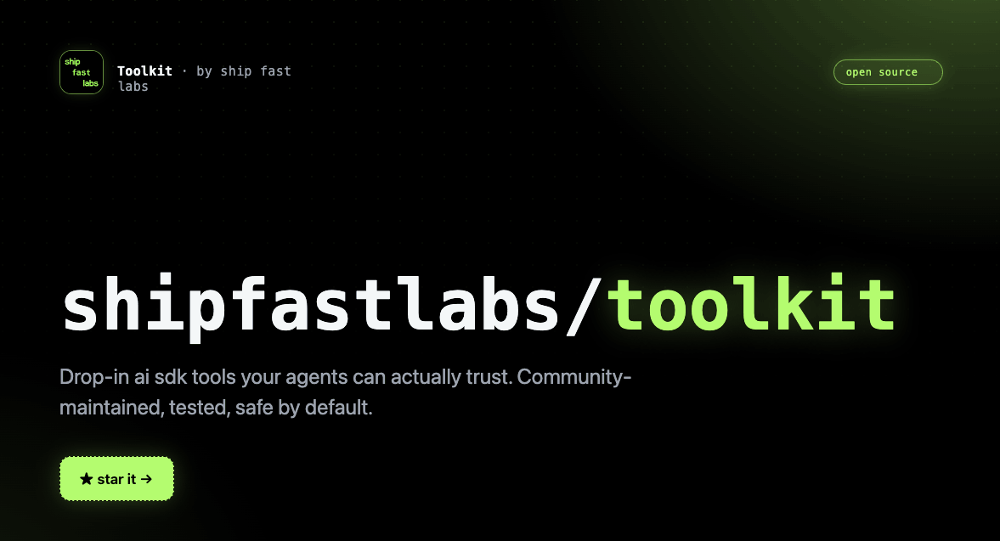

    

    
    

## Introduction

Toolkit is a community catalog of reusable AI tools for the [Laravel AI SDK](https://github.com/laravel/ai).

> Requires PHP 8.4+ and `laravel/ai`.

## Available Tools

| Tool | Description |
|------|-------------|
| `CalculatorTool` | Evaluate mathematical expressions with perfect accuracy. Supports `+`, `-`, `*`, `/`, `%`, `^`, parentheses, and decimals. |
| `DatabaseQueryTool` | Run read-only `SELECT` queries against your Laravel database and return results as JSON. |
| `TavilySearch` | Search the web for real-time information using [Tavily](https://tavily.com). |
| `TavilyExtract` | Extract clean, structured content from URLs. |
| `TavilyCrawl` | Intelligently crawl a website and extract content. |
| `TavilyMap` | Discover and map a website's structure. |
| `PerplexitySearch` | Search the web for real-time information using [Perplexity](https://perplexity.ai). |
| `PerplexityAsk` | Ask a question and get a direct, cited answer from Perplexity's Sonar models. |

## Official Documentation

Documentation for Toolkit can be found on the [documentation site](https://toolkit.shipfastlabs.com).

## Contributing

Thank you for considering contributing to Toolkit! The contribution guide can be found in
[CONTRIBUTING.md](CONTRIBUTING.md).

## Code of Conduct

In order to ensure that the community is welcoming to all, please review and abide by the
[Code of Conduct](CODE_OF_CONDUCT.md).

## Security Vulnerabilities

Please review [our security policy](SECURITY.md) on how to report security vulnerabilities.

## License

Toolkit is open-sourced software licensed under the [MIT license](LICENSE.md).
